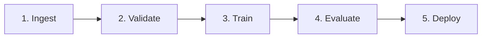
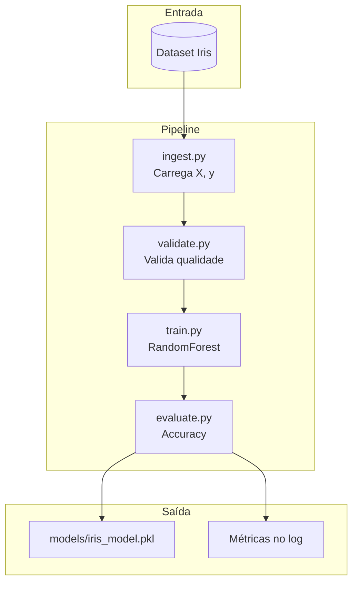

# 🏗️ Arquitetura do Pipeline de ML

**Aula 01** apresenta a estrutura base de um pipeline de Machine Learning aplicando princípios DevOps (MLOps).

---

## 🎯 Visão Geral



| Etapa | Responsabilidade | Arquivo |
|-------|------------------|---------|
| **1. Ingest** | Carregar dados (CSV, BD, API) | `src/data/ingest.py` |
| **2. Validate** | Verificar qualidade dos dados | `src/data/validate.py` |
| **3. Train** | Treinar o modelo | `src/train/train.py` |
| **4. Evaluate** | Medir performance | `src/train/evaluate.py` |
| **5. Deploy** | Persistir/publicar modelo | `src/pipeline.py` |

---

## 📁 Estrutura de Diretórios

```
fiap-ml-aula01/
├── .gitignore                  # Arquivos ignorados pelo Git
├── README.md                   # Visão geral da aula
├── requirements.txt            # Dependências Python (pip)
├── pytest.ini                  # Configuração de testes
├── config.yaml                 # Parâmetros do pipeline
├── docs/
│   ├── ARCHITECTURE.md         # Este arquivo
│   ├── CHEATSHEET.md           # Comandos rápidos
│   ├── HANDS-ON-01-01.md       # Vídeo 1.1 - Setup
│   ├── HANDS-ON-01-02.md       # Vídeo 1.2 - Pipeline modular
│   └── HANDS-ON-01-03.md       # Vídeo 1.3 - Testes
├── src/
│   ├── data/
│   │   ├── ingest.py           # Ingestão de dados
│   │   └── validate.py         # Validação de dados
│   ├── train/
│   │   ├── train.py            # Treinamento
│   │   └── evaluate.py         # Avaliação
│   └── pipeline.py             # Orquestrador
├── tests/
│   ├── test_data.py            # Testes de ingestão/validação
│   ├── test_train.py           # Testes de treino
│   └── test_pipeline.py        # Teste E2E
└── models/                     # Modelos treinados (.pkl)
```

---

## 🔄 Fluxo de Dados



---

## 🧱 Princípios Aplicados

### 1. Modularização
Cada etapa em um arquivo separado → facilita teste, debug e reuso.

### 2. Logging Estruturado
Todos os módulos usam `logging` (não `print`) → preparado para produção.

### 3. Reprodutibilidade
`random_state=42` em todas as operações estocásticas → resultado idêntico em qualquer máquina.

### 4. Testabilidade
Cada módulo é uma função pura → testável com `pytest`.

### 5. Configuração Externa
Parâmetros em `config.yaml` → mudar comportamento sem alterar código.

---

## 🆚 ETL Tradicional vs Pipeline de ML

| Aspecto | ETL | Pipeline ML |
|---------|-----|-------------|
| **Entrada** | Dados estruturados | Dados estruturados + não-estruturados |
| **Processamento** | SQL, transformações | Feature engineering + treinamento |
| **Saída** | Tabela/Data Warehouse | Modelo (.pkl) + métricas |
| **Validação** | Schema | Schema + distribuição estatística |
| **Reexecução** | Determinística | Estocástica (requer `random_state`) |
| **Monitoramento** | Latência, falhas | Latência + drift + accuracy |

---

## 🚀 Próximas Aulas

| Aula | Adiciona ao pipeline |
|------|---------------------|
| **02** | Feature Engineering robusta |
| **03** | Validação cruzada + MLflow |
| **04** | API REST + Docker |
| **05** | Orquestração com Airflow |
| **06** | DVC + Great Expectations |
| **07** | Re-treino automático |
| **08** | CI/CD completo |
