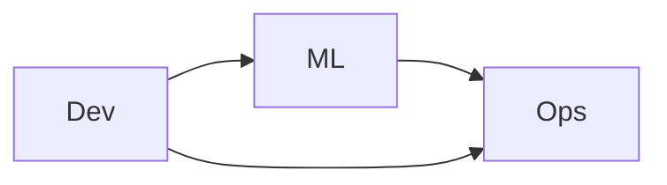

# 🎬 Vídeo 1.1 - Setup do Ambiente MLOps

**Aula**: 1 - Introdução ao Pipeline de ML  
**Vídeo**: 1.1  
**Temas**: Setup do ambiente Python; Estrutura de projeto MLOps; Primeiro modelo funcionando

---

## 🚀 Sobre Este Vídeo

> **Aula inicial do curso!** Aqui você prepara o ambiente e treina seu primeiro modelo de ML de forma reprodutível.

### O que você vai fazer:

| Etapa | Descrição |
|-------|-----------|
| **Python venv** | Criar ambiente virtual isolado |
| **Dependências** | Instalar scikit-learn, pandas |
| **Estrutura** | Criar pastas no padrão MLOps |
| **Primeiro modelo** | Treinar e salvar um modelo |

### Pré-requisitos

| Requisito | Como verificar |
|-----------|----------------|
| Python 3.11 ou 3.12 | `python3 --version` |
| Git instalado | `git --version` |
| Editor de código | VS Code, PyCharm ou similar |
| Terminal | Bash (Linux/Mac) ou PowerShell (Windows) |

> ⚠️ **Versão do Python**: use Python **3.11 ou 3.12**. As versões fixadas no `requirements.txt` (scikit-learn 1.3.0 etc.) não têm pacotes pré-compilados para versões muito novas (3.13+), e o pip tentaria compilar do zero — o que falha no macOS. Verifique com `python3 --version` antes de criar o venv.

---

## 📚 Parte 1: Conceitos Fundamentais

### Passo 1: O que é MLOps?

**MLOps** = Machine Learning + DevOps + Data Engineering



**Diferença para projetos tradicionais de ML:**

| Aspecto | ML Tradicional | MLOps |
|---------|---------------|-------|
| **Ambiente** | Notebook Jupyter | Código em produção |
| **Reprodutibilidade** | "Funciona no meu PC" | Container + versionamento |
| **Deploy** | Manual | Automatizado |
| **Monitoramento** | Nenhum | Drift + métricas |

> 💡 **Ponto-chave**: MLOps não é uma ferramenta — é uma **cultura** de aplicar práticas DevOps em projetos de ML.

---

### Passo 2: Estrutura de um Projeto MLOps

```
projeto-ml/
├── src/                    # Código-fonte
│   ├── data/              # Ingestão de dados
│   ├── features/          # Feature engineering
│   ├── train/             # Treinamento
│   └── api/               # API de inferência
├── tests/                  # Testes automatizados
├── models/                 # Modelos treinados (.pkl)
├── data/                   # Datasets
├── notebooks/              # Experimentação
├── requirements.txt        # Dependências
├── Dockerfile              # Container
└── .github/workflows/      # CI/CD
```

> ⚠️ **IMPORTANTE**: Nunca commite modelos `.pkl` ou dados grandes no Git. Use DVC ou S3.

---

## 🛠️ Parte 2: Preparar o Ambiente

### Passo 3: Criar Pasta de Trabalho

**Linux/Mac:**
```bash
mkdir -p ~/fiap-mlops/aula01
cd ~/fiap-mlops/aula01
```

**Windows (PowerShell):**
```powershell
New-Item -ItemType Directory -Path "$HOME\fiap-mlops\aula01" -Force
cd "$HOME\fiap-mlops\aula01"
```

**Resultado esperado:** Pasta criada e você está dentro dela.

✅ Pasta de trabalho pronta.

---

### Passo 4: Criar Ambiente Virtual Python

> **Por que venv?** Isola dependências do projeto. Evita conflito entre versões.

**Linux/Mac:**
```bash
# Criar venv (use python3.11 ou python3.12)
python3.11 -m venv venv

# Ativar
source venv/bin/activate

# Verificar (deve apontar para .../venv/bin/python)
which python
```

**Windows (PowerShell):**
```powershell
# Criar venv
python -m venv venv

# Ativar
.\venv\Scripts\Activate.ps1

# Verificar
Get-Command python
```

**Resultado esperado:**
```
/Users/seu-usuario/fiap-mlops/aula01/venv/bin/python
```

✅ Ambiente virtual ativado (você verá `(venv)` no início do prompt).

---

### Passo 5: Instalar Dependências

**Criar arquivo `requirements.txt`** (cobre toda a Aula 01):

```txt
scikit-learn==1.3.0
pandas==2.0.3
numpy==1.24.3
joblib==1.3.2
pyyaml==6.0.1
pytest==7.4.0
pytest-cov==4.1.0
```

> 💡 Já incluímos `pyyaml` (usado no Vídeo 1.2) e `pytest`/`pytest-cov` (Vídeo 1.3) para instalar tudo de uma vez.

**Instalar:**

**Linux/Mac:**
```bash
pip install -r requirements.txt
```

**Windows (PowerShell):**
```powershell
pip install -r requirements.txt
```

**Resultado esperado:**
```
Successfully installed scikit-learn-1.3.0 pandas-2.0.3 joblib-1.3.2 ...
```

✅ Dependências instaladas.

---

### Passo 6: Criar Estrutura de Pastas

**Linux/Mac:**
```bash
mkdir -p src/data src/train tests models data
touch src/__init__.py src/data/__init__.py src/train/__init__.py
ls -la
```

**Windows (PowerShell):**
```powershell
New-Item -ItemType Directory -Path src\data, src\train, tests, models, data -Force
New-Item -ItemType File -Path src\__init__.py, src\data\__init__.py, src\train\__init__.py -Force
Get-ChildItem
```

**Resultado esperado:**
```
src/  tests/  models/  data/  requirements.txt  venv/
```

✅ Estrutura criada.

---

## 🎯 Parte 3: Primeiro Modelo

### Passo 7: Criar Script de Treinamento

**Criar arquivo `src/train/train.py`:**

```python
"""Treina um classificador simples no dataset Iris."""
from sklearn.datasets import load_iris
from sklearn.ensemble import RandomForestClassifier
from sklearn.model_selection import train_test_split
from sklearn.metrics import accuracy_score
import joblib
from pathlib import Path

def main():
    # 1. Carregar dados
    print("📥 Carregando dataset Iris...")
    X, y = load_iris(return_X_y=True)
    
    # 2. Dividir treino/teste
    X_train, X_test, y_train, y_test = train_test_split(
        X, y, test_size=0.2, random_state=42
    )
    print(f"   Treino: {len(X_train)} | Teste: {len(X_test)}")
    
    # 3. Treinar modelo
    print("🎯 Treinando modelo...")
    model = RandomForestClassifier(n_estimators=100, random_state=42)
    model.fit(X_train, y_train)
    
    # 4. Avaliar
    accuracy = accuracy_score(y_test, model.predict(X_test))
    print(f"✅ Accuracy: {accuracy:.3f}")
    
    # 5. Salvar
    Path("models").mkdir(exist_ok=True)
    joblib.dump(model, "models/iris_model.pkl")
    print("💾 Modelo salvo em models/iris_model.pkl")

if __name__ == "__main__":
    main()
```

> 📌 **Atenção (evolução do arquivo)**: esta é a versão **monolítica** do `train.py`, feita para você treinar um primeiro modelo rapidamente. No **Vídeo 1.2** este mesmo arquivo será **refatorado** em uma função reutilizável `train_model()`, usada pelo `pipeline.py` e pelos testes do Vídeo 1.3. Ou seja, a versão final do repositório é a do 1.2 — esta aqui é um passo intermediário de aprendizado.

---

### Passo 8: Executar o Treinamento

**Linux/Mac:**
```bash
python src/train/train.py
```

**Windows (PowerShell):**
```powershell
python src\train\train.py
```

**Resultado esperado:**
```
📥 Carregando dataset Iris...
   Treino: 120 | Teste: 30
🎯 Treinando modelo...
✅ Accuracy: 0.967
💾 Modelo salvo em models/iris_model.pkl
```

✅ Primeiro modelo treinado!

---

### Passo 9: Validar o Modelo Salvo

**Linux/Mac:**
```bash
ls -lh models/iris_model.pkl
```

**Windows (PowerShell):**
```powershell
Get-Item models\iris_model.pkl | Select-Object Name, Length
```

**Resultado esperado:**
```
-rw-r--r--  1 user  staff   180K models/iris_model.pkl
```

✅ Modelo persistido no disco.

---

## 📦 Parte 4: Versionar o Projeto

### Passo 10: Inicializar Git

**Criar `.gitignore`:**

```gitignore
# Python
__pycache__/
*.py[cod]
venv/

# Modelos e dados (grandes!)
models/*.pkl
data/*.csv

# IDE
.vscode/
.idea/
.DS_Store
```

**Linux/Mac:**
```bash
git init
git add .gitignore requirements.txt src/
git commit -m "feat: setup inicial do projeto MLOps"
```

**Windows (PowerShell):**
```powershell
git init
git add .gitignore requirements.txt src/
git commit -m "feat: setup inicial do projeto MLOps"
```

**Resultado esperado:**
```
[main (root-commit) abc1234] feat: setup inicial do projeto MLOps
 5 files changed, 50 insertions(+)
```

✅ Projeto versionado.

---

## 🔧 Troubleshooting

| Erro | Causa | Solução |
|------|-------|---------|
| `python: command not found` | Python não instalado ou não no PATH | Instalar Python 3.11/3.12 e reabrir terminal |
| `ModuleNotFoundError: sklearn` | venv não ativado | Reativar venv (Passo 4) |
| `clang: error: unsupported option '-fopenmp'` ou erro de Cython | Python novo demais (3.13+); pip tenta compilar sklearn | Recriar o venv com Python 3.11/3.12 |
| `which python` aponta para fora do venv | Shim do pyenv ou venv corrompido | Reativar venv; se persistir, apagar e recriar com `python3.11 -m venv venv` |
| `Activate.ps1 cannot be loaded` (Win) | Política de execução do PowerShell | `Set-ExecutionPolicy -Scope CurrentUser RemoteSigned` |
| `Permission denied` ao criar pasta | Permissão na home | Usar `sudo` ou criar em outra pasta |
| Accuracy diferente de 0.967 | `random_state` diferente | Garantir `random_state=42` |

---

**FIM DO VÍDEO 1.1** ✅
