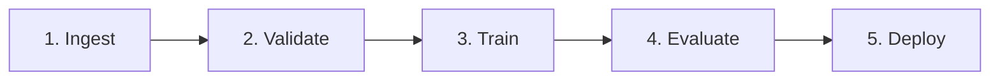

# 🎬 Vídeo 1.2 - Anatomia de um Pipeline de ML

**Aula**: 1 - Introdução ao Pipeline de ML  
**Vídeo**: 1.2  
**Temas**: Etapas de um pipeline; Modularização; Reprodutibilidade; Logging

---

## 🚀 Sobre Este Vídeo

> **Transformar um script monolítico em pipeline modular** — cada etapa em um arquivo separado.

### O que você vai fazer:

| Etapa | Descrição |
|-------|-----------|
| **Modularizar** | Quebrar treino em etapas |
| **Pipeline** | Encadear etapas |
| **Logging** | Adicionar logs estruturados |
| **Config** | Externalizar parâmetros |

### Pré-requisitos

| Requisito | Como verificar |
|-----------|----------------|
| Aula 1.1 concluída | Pasta `~/fiap-mlops/aula01` existe |
| venv ativado | Prompt mostra `(venv)` |
| Modelo iris_model.pkl | `ls models/` |

---

## 📚 Parte 1: Anatomia do Pipeline

### Passo 1: As 5 Etapas Padrão

Todo pipeline de ML tem 5 etapas:



| # | Etapa | O que faz |
|---|-------|-----------|
| **1** | Ingest | Carrega dados (CSV, BD, API) |
| **2** | Validate | Verifica qualidade dos dados |
| **3** | Train | Treina o modelo |
| **4** | Evaluate | Mede performance |
| **5** | Deploy | Salva/publica o modelo |

> 💡 **Ponto-chave**: Cada etapa = um arquivo Python separado. Facilita teste, debug e CI/CD.

---

### Passo 2: Antes vs Depois

**Antes (script único — RUIM):**
```python
# train.py — tudo misturado
data = load_data()
data = validate(data)
model = train(data)
metrics = evaluate(model)
save(model)
```

**Depois (modular — BOM):**
```
src/
├── data/ingest.py       # 1. Carregar
├── data/validate.py     # 2. Validar
├── train/train.py       # 3. Treinar
├── train/evaluate.py    # 4. Avaliar
└── pipeline.py          # Orquestrador
```

---

## 🛠️ Parte 2: Construir o Pipeline

### Passo 3: Criar Módulo de Ingestão

**Criar `src/data/ingest.py`:**

```python
"""Carrega dados do dataset Iris."""
import logging
from sklearn.datasets import load_iris

logger = logging.getLogger(__name__)

def load_data():
    """Carrega e retorna X, y."""
    logger.info("Carregando dataset Iris...")
    X, y = load_iris(return_X_y=True)
    logger.info(f"Dataset carregado: {X.shape[0]} amostras, {X.shape[1]} features")
    return X, y
```

✅ Módulo de ingestão criado.

---

### Passo 4: Criar Módulo de Validação

**Criar `src/data/validate.py`:**

```python
"""Valida qualidade dos dados."""
import logging
import numpy as np

logger = logging.getLogger(__name__)

def validate_data(X, y):
    """Valida que os dados estão OK para treino."""
    logger.info("Validando dados...")
    
    # 1. Não vazio
    assert len(X) > 0, "Dataset vazio!"
    
    # 2. X e y mesmo tamanho
    assert len(X) == len(y), "X e y com tamanhos diferentes!"
    
    # 3. Sem NaN
    assert not np.isnan(X).any(), "X contém NaN!"
    
    # 4. Pelo menos 2 classes
    assert len(np.unique(y)) >= 2, "Menos de 2 classes!"
    
    logger.info(f"✅ Dados válidos: {len(X)} amostras, {len(np.unique(y))} classes")
    return True
```

---

### Passo 5: Criar Módulo de Treino

**Substituir o conteúdo de `src/train/train.py`** (trocamos a versão monolítica do Vídeo 1.1 por esta versão modular):

> 📌 A versão do 1.1 tinha um `def main()` que rodava sozinho. Agora extraímos a lógica para a função `train_model()`, que o `pipeline.py` vai orquestrar e os testes do 1.3 vão importar.

```python
"""Treina modelo de classificação."""
import logging
from sklearn.ensemble import RandomForestClassifier
from sklearn.model_selection import train_test_split

logger = logging.getLogger(__name__)

def train_model(X, y, n_estimators=100, random_state=42):
    """Treina e retorna modelo + dados de teste."""
    logger.info(f"Treinando RandomForest com {n_estimators} árvores...")
    
    X_train, X_test, y_train, y_test = train_test_split(
        X, y, test_size=0.2, random_state=random_state
    )
    
    model = RandomForestClassifier(
        n_estimators=n_estimators,
        random_state=random_state
    )
    model.fit(X_train, y_train)
    
    logger.info(f"✅ Modelo treinado em {len(X_train)} amostras")
    return model, X_test, y_test
```

---

### Passo 6: Criar Módulo de Avaliação

**Criar `src/train/evaluate.py`:**

```python
"""Avalia performance do modelo."""
import logging
from sklearn.metrics import accuracy_score, classification_report

logger = logging.getLogger(__name__)

def evaluate_model(model, X_test, y_test):
    """Avalia e retorna métricas."""
    logger.info("Avaliando modelo...")
    
    y_pred = model.predict(X_test)
    accuracy = accuracy_score(y_test, y_pred)
    
    logger.info(f"✅ Accuracy: {accuracy:.3f}")
    logger.info("\n" + classification_report(y_test, y_pred))
    
    return {"accuracy": accuracy}
```

---

### Passo 7: Criar Pipeline Principal

**Criar `src/pipeline.py`:**

```python
"""Pipeline completo de ML."""
import logging
import joblib
from pathlib import Path

from data.ingest import load_data
from data.validate import validate_data
from train.train import train_model
from train.evaluate import evaluate_model

# Configurar logging
logging.basicConfig(
    level=logging.INFO,
    format='%(asctime)s | %(name)s | %(levelname)s | %(message)s'
)
logger = logging.getLogger("pipeline")

def run_pipeline():
    """Executa pipeline end-to-end."""
    logger.info("🚀 Iniciando pipeline...")
    
    # 1. Ingest
    X, y = load_data()
    
    # 2. Validate
    validate_data(X, y)
    
    # 3. Train
    model, X_test, y_test = train_model(X, y)
    
    # 4. Evaluate
    metrics = evaluate_model(model, X_test, y_test)
    
    # 5. Deploy (salvar)
    Path("models").mkdir(exist_ok=True)
    joblib.dump(model, "models/iris_model.pkl")
    logger.info("💾 Modelo salvo em models/iris_model.pkl")
    
    logger.info(f"🎉 Pipeline concluído! Accuracy: {metrics['accuracy']:.3f}")
    return metrics

if __name__ == "__main__":
    run_pipeline()
```

---

## ▶️ Parte 3: Executar o Pipeline

### Passo 8: Rodar o Pipeline

**Linux/Mac:**
```bash
cd src
python pipeline.py
```

**Windows (PowerShell):**
```powershell
cd src
python pipeline.py
```

**Resultado esperado:**
```
2026-06-26 09:30:01 | pipeline | INFO | 🚀 Iniciando pipeline...
2026-06-26 09:30:01 | data.ingest | INFO | Carregando dataset Iris...
2026-06-26 09:30:01 | data.ingest | INFO | Dataset carregado: 150 amostras, 4 features
2026-06-26 09:30:01 | data.validate | INFO | ✅ Dados válidos: 150 amostras, 3 classes
2026-06-26 09:30:01 | train.train | INFO | ✅ Modelo treinado em 120 amostras
2026-06-26 09:30:01 | train.evaluate | INFO | ✅ Accuracy: 0.967
2026-06-26 09:30:01 | pipeline | INFO | 💾 Modelo salvo em models/iris_model.pkl
2026-06-26 09:30:01 | pipeline | INFO | 🎉 Pipeline concluído! Accuracy: 0.967
```

✅ Pipeline rodou de ponta a ponta com logs estruturados.

---

### Passo 9: Verificar Modelo Salvo

**Linux/Mac:**
```bash
cd ..
ls -lh models/
```

**Windows (PowerShell):**
```powershell
cd ..
Get-ChildItem models\
```

**Resultado esperado:**
```
-rw-r--r--  1 user  staff   180K iris_model.pkl
```

✅ Modelo persistido.

---

## ⚙️ Parte 4: Externalizar Configurações

### Passo 10: Criar Arquivo de Config

**Criar `config.yaml`:**

```yaml
data:
  test_size: 0.2
  random_state: 42

model:
  type: "RandomForest"
  n_estimators: 100
  max_depth: 10

output:
  model_path: "models/iris_model.pkl"
```

**Instalar PyYAML** (já incluído no `requirements.txt` da Aula 01; rode apenas se ainda não tiver instalado):

**Linux/Mac:**
```bash
pip install pyyaml
```

**Windows (PowerShell):**
```powershell
pip install pyyaml
```

**Resultado esperado:** `Requirement already satisfied: pyyaml` (ou `Successfully installed pyyaml-6.0.1`)

---

### Passo 11: Usar Config no Pipeline

**Atualizar `src/pipeline.py` no início:**

```python
import yaml

# Carregar config
with open("../config.yaml") as f:
    config = yaml.safe_load(f)

# Usar:
model, X_test, y_test = train_model(
    X, y,
    n_estimators=config["model"]["n_estimators"],
    random_state=config["data"]["random_state"]
)
```

> 💡 **Ponto-chave**: Externalizar config permite mudar parâmetros sem alterar código.

✅ Pipeline configurável.

---

## 🔧 Troubleshooting

| Erro | Causa | Solução |
|------|-------|---------|
| `ModuleNotFoundError: data` | Rodou de fora da pasta `src/` | `cd src` antes de executar |
| `AssertionError: Dataset vazio!` | Erro na ingestão | Verificar `load_iris()` |
| `FileNotFoundError: config.yaml` | Path errado | Ajustar caminho relativo |
| Logs não aparecem | `logging.basicConfig` chamado tarde | Configurar logging ANTES de importar módulos |

---

**FIM DO VÍDEO 1.2** ✅
